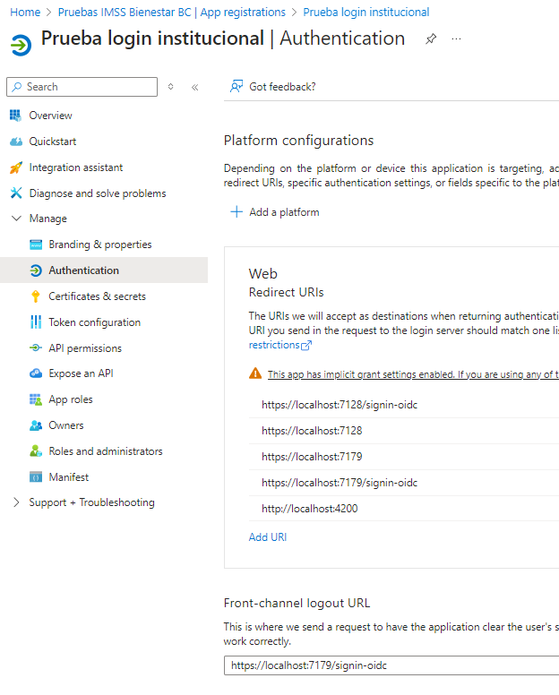

# EntraID-MVC template

Este es un proyecto template para loguearse con credenciales azure en futuros proyectos estatales de IMSS-Bienestar
para propósitos de pruebas en Azure.

# Setup 

## Agregando nuevos usuarios

Aqui agregar usuarios existentes de las cuentas institucionales

## Registrar app

### Configurar redirectUrls

### Tomar nota de clientId y tenant Id

### Crear client secret

#### IMPORTANTE: Copiar el client secret value
Esto es porque solo se puede copiar en clipboard una sola vez.
Asegurarse de guardarlo en un lugar seguro!

# Recursos de apoyo

https://blog.nashtechglobal.com/integrating-microsoft-entra-id-previously-azure-active-directory-with-net-core-application/